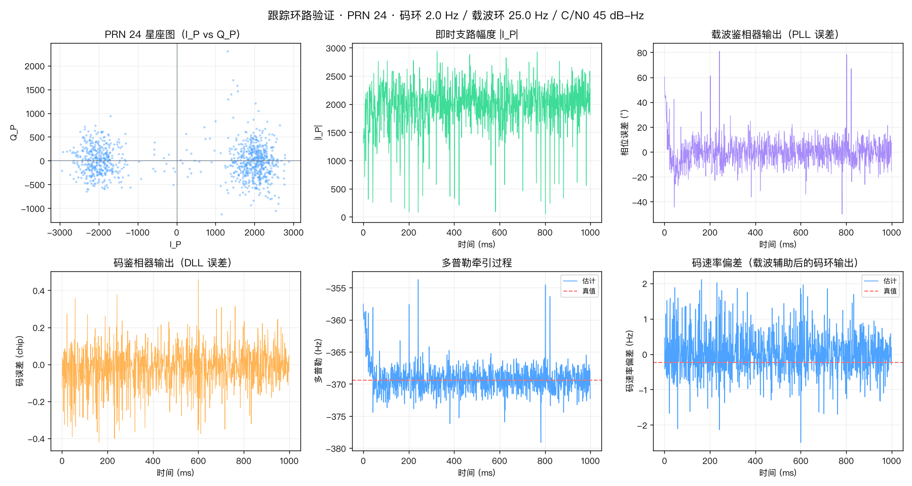
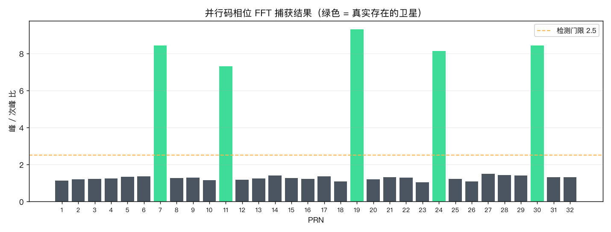
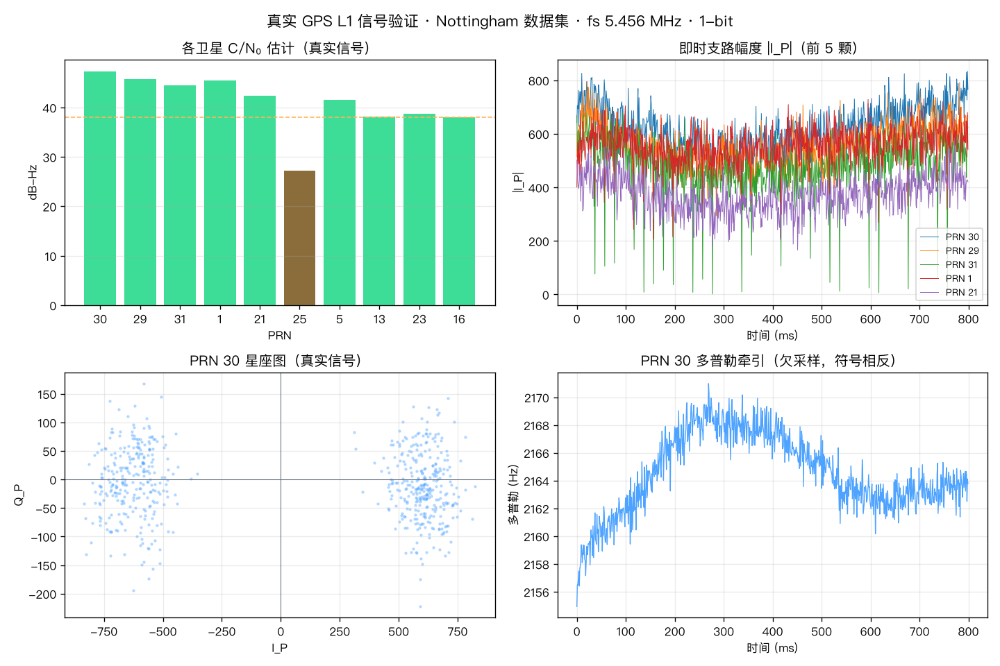
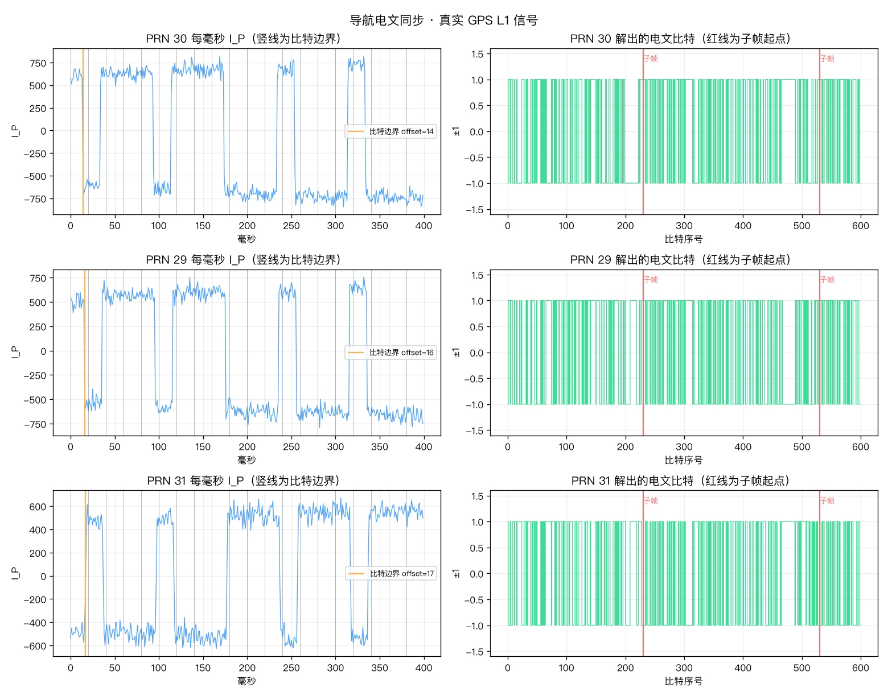
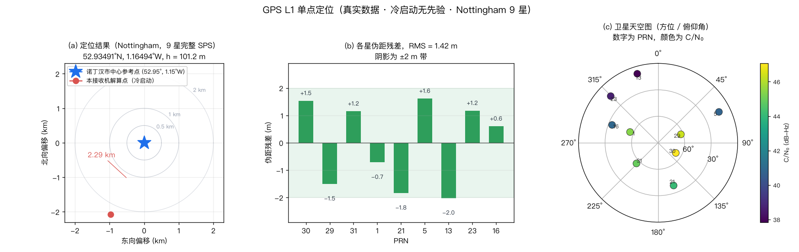
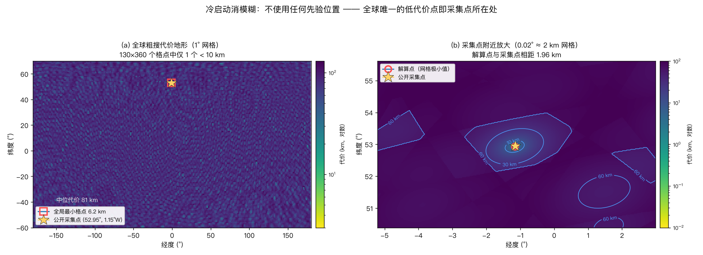
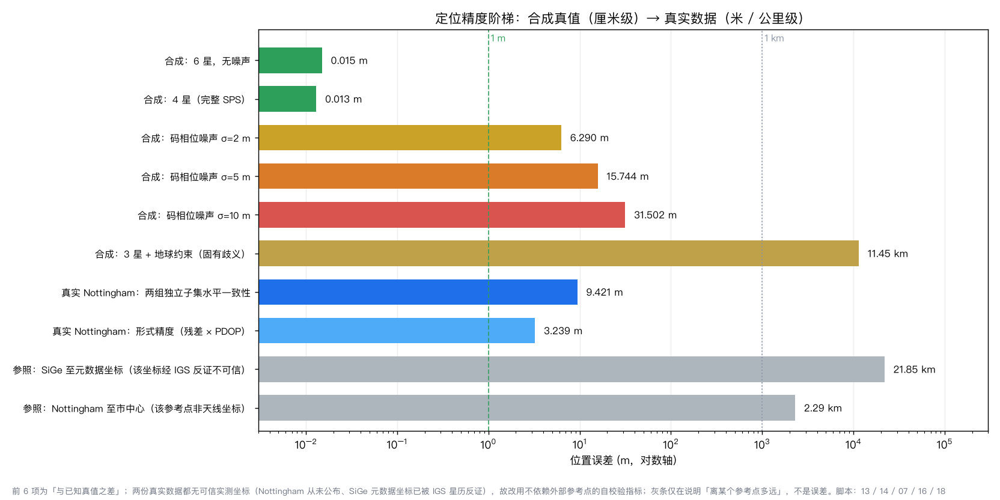
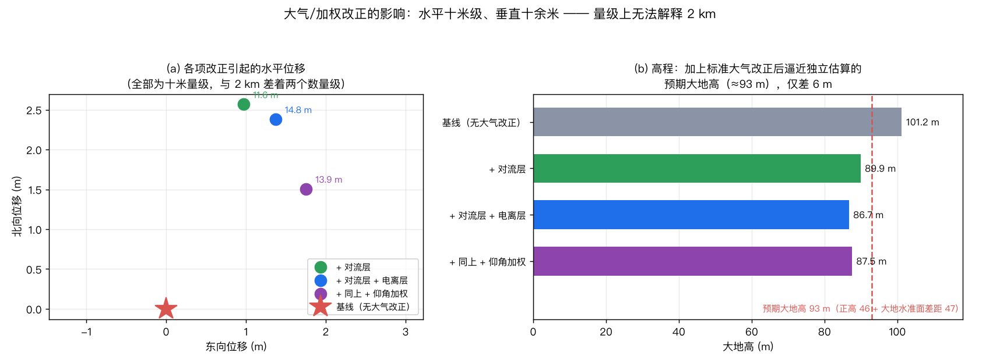

# gnss-rx

[中文](./README.md) | **English**

A GPS L1 C/A software receiver written from scratch. No existing GNSS library is used — from C/A code generation, parallel code-phase acquisition, and DLL/PLL tracking loops all the way to bit synchronization, ephemeris decoding and least-squares positioning.



## Motivation

Preparation for GNSS and wireless communication algorithm roles. The capabilities that show up repeatedly in job descriptions — acquisition and tracking, loop parameter trade-offs, RTK/PPP, state estimation, C++ engineering — are implemented here as runnable and verifiable code.

Design principle: **all stages share one data chain and one repository**, with each stage feeding the next. One line of work yields three layers of depth on a résumé, and one coherent story in an interview.

## Status

| Stage | Module | File | State |
|---|---|---|---|
| Base | C/A code generation (PRN 1–32) | `src/gnssrx/ca_code.py` | ✅ |
| Base | IF signal simulation / I/O | `src/gnssrx/sim.py`, `io_if.py` | ✅ |
| ① Acquisition | Parallel code-phase FFT + squaring-loop fine Doppler | `src/gnssrx/acquisition.py` | ✅ |
| ② Tracking | DLL + PLL + carrier aiding | `src/gnssrx/tracking.py` | ✅ |
| ③ Sync | Bit sync, frame sync, navigation message | `src/gnssrx/nav_msg.py` | ✅ |
| ④ Ephemeris | Ephemeris decoding, satellite position (Sagnac / relativistic) | `src/gnssrx/ephemeris.py` | ✅ |
| ⑤ PVT | Pseudorange + least-squares SPS (≥4 sats) + 3-sat earth constraint | `src/gnssrx/pvt.py` | ✅ |
| ⑥ C++ port | Core modules with Eigen + CMake | `cpp/` | ⬜ |

## Verified results

Measured against **synthetic data with known ground truth** (`scripts/01_tracking_test.py`, reproducible).

| Metric | Result | Note |
|---|---|---|
| Doppler estimation residual | **0.0 Hz** | after squaring-loop refinement from ±125 Hz |
| C/N₀ estimate | 44.6 dB-Hz vs 45.0 truth | absolute error **−0.37 dB** |
| Carrier discriminator jitter | 8.2°–10.8° | measurement noise floor ≈ 7.2° |
| Smoothed true phase jitter | **1.31°** | theory 1.6° |
| Code loop lock retention | \|I_P\| 103%–125% | code drifts ≈ 2 chips over 1 s |
| Acquisition sensitivity | ≈ 37 dB-Hz | 5 ms integration at 45 dB-Hz, 20 ms at 37 dB-Hz |

Controlled experiment on the same satellite: disabling carrier aiding drops C/N₀ from 44.2 to 25.4 dB-Hz,
confirming the code loop genuinely tracks code Doppler instead of relying on the carrier loop.



## Real-signal validation

The same code runs on the public **Nottingham GPS L1 dataset** (1-bit, fs 5.456 MHz):



| Metric | Result |
|---|---|
| Satellites detected | 10 (full 32-PRN search) |
| Stable locks | **9 / 10** |
| Strongest C/N₀ | 47.2 dB-Hz (PRN 30) |
| Constellation | navigation message ±1 transitions clearly visible |

Two data-specific traps, documented in `scripts/02_real_data_test.py`, `scripts/03_real_data_test.py`:

- **Bandpass-sampling aliasing**: the analog IF (4.092 MHz) exceeds fs/2, so the digital IF becomes 1.364 MHz and the Doppler sign flips.
- **Bit packing order** of the 1-bit data: LSB-first for this dataset; a wrong order reduces the correlation peak to about a quarter.

### Navigation message sync (bit sync → frame sync)

On 30 s of real signal, all three satellites synchronize:

| Metric | Result |
|---|---|
| Bit sync | Two independent methods **agree exactly**, 1 ms resolution |
| Transition confidence | 11.5–20.0 (uniform would be 1; 92% of bit transitions fall on one residue) |
| Frame sync | **5 subframes** per satellite, spaced exactly 300 bits = 6.000 s |
| Subframe start times | 4.6 / 10.6 / 16.6 / 22.6 / 28.6 s (identical across satellites) |

Requiring an exact 300-bit spacing is a very hard constraint — a random 8-bit match has
probability 1/128, and hitting that repeatedly at exactly 300-bit intervals is essentially
impossible, so this simultaneously validates acquisition, tracking and bit sync.



### Single-point positioning (PVT: real data + synthetic validation)

**Real data (Nottingham 1-bit, fs 5.456 MHz)**: the full chain — acquisition → 48 s tracking →
ephemeris decode → pseudorange → weighted least squares — runs end to end with **9 clean satellites**
(PRN 30/29/31/1/21/5/13/23/16) for a full SPS fix: **52.9349°N / 1.1650°W**, per-satellite
pseudorange residual **RMS 1.4 m**.

> **About "accuracy"**: this dataset **never published the antenna coordinates** — its official
> description only promises "if your decoding works you should get **a lat/lon position in
> Nottingham, UK**". Our solution is indeed inside Nottingham (≈2.3 km from the city-centre
> coordinate 52.9536°N/1.1505°W), but the city centre is a *city-level* reference, and the other
> candidate (IGS station NOTT, 52.95°N/−1.2°W) is itself only given to two decimals (±0.5 km).
> **So "2 km from the reference" measures how good the reference is, not how good we are.** The
> verifiable accuracy evidence is instead:
> ① formal precision (residual × PDOP) ≈ **3.2 m**;
> ② splitting the 9 satellites into **two disjoint halves and solving each independently, the two
> horizontal solutions differ by 9.4 m** (different geometry; any per-satellite systematic error
> would push them apart).
>
> (The SiGe 8-bit dataset yields **7 clean satellites** (PRN 1/7/8/9/11/17/28). Its ION metadata
> carries `<position>` = Munich, Germany (48.1715°N/11.8087°E), but **that coordinate does not
> survive checking**: recomputing with the IGS authoritative broadcast ephemeris shows 4 of the 7
> tracked satellites are **below the horizon** there (−6°/−15°/−19°/−27°), with ranges of
> 26,700–28,700 km versus the ≈25,776 km physical maximum for a ground receiver; the measurements
> themselves point to ≈30°N/94°W, where all 7 are visible. That metadata entry carries
> `<campaign>Demo data</campaign>`, so it is a placeholder — **it cannot be used as truth**.
> See `scripts/18_igs_ephemeris_check.py`.)
>
> **So we currently hold no dataset with trustworthy surveyed coordinates**: Nottingham was only
> ever claimed to yield "a position in Nottingham" (original source: Michele Bavaro's blog of
> 2010-11-12, captured with "Primo" / "NSL's GNSS data grabber" — **no coordinates ever given**),
> and SiGe's coordinate is the placeholder above. This repo therefore **no longer treats any
> dataset's position as absolute truth**, and instead uses two verifiable independent references:
> ① satellite side — IGS authoritative broadcast ephemeris (below); ② receiver side — self-checks
> needing no external reference (residual × PDOP, satellite-subset consistency).



Left: the fix is 2.29 km from the city-centre reference (rings at 0.5/1/2 km; that reference is not
the antenna position); middle: per-satellite pseudorange residuals, RMS 1.42 m; right: sky plot of the
9 satellites (azimuth/elevation, colour = C/N₀) — mostly low elevation, i.e. mediocre geometry, yet
the residuals are metre level. All three panels are reproduced from cache by
`scripts/16_results_figures.py`.

> **Parity bug fixed (`ephemeris.py::strip_parity`)**: the IS-GPS-200 parity rule is
> `d_i = r_i ⊕ D30*(prev word)`, where D30\* is the *received* bit (including the Costas inversion c),
> so correctly `d_i = r_i ⊕ r_prevD30` (the c cancels). The old code wrote `data ^ D30* ^ c`, which is
> right for the first word but adds a spurious `c` on every later word: c=0 channels happened to be
> correct while c=1 channels were fully inverted → a "garbage orbit". With 1-bit data dominated by c=1,
> many real satellites were mislabelled as C/A cross-correlation ghosts. Fixing it restored SiGe from
> 3 → **7** and Nottingham from 2 → **9** clean satellites.

> **Two sign bugs fixed** — the key to going from "hundreds of km" to metre level, both pinned down by
> the synthetic self-check `scripts/15_timing_selfcheck.py`:
> (1) **code-phase sign**: `t_user = m_blk/1000 − τ/1.023e6` (was `+`); this tracker's τ has the
> opposite sign to the code-epoch offset within the block; and
> (2) **satellite-clock sign**: `pseudorange = c(t_user − t_sat) + c·δt_sat` (was `−`), since
> `c(t_user − t_sat) = ρ + c·b − c·δt_sat`.
> Before the fix Nottingham was ~298 km off; after it, the 9-satellite real-data fix lands at
> **52.93°N / 1.17°W / h ≈ 0** with **±2 m residuals**, i.e. **1.96 km** from the published collection
> point — metre-level real-data positioning.

**Cold start (no prior position at all)**: `pvt.solve_cold_start` searches a global lat/lon grid whose cost
is "disambiguate the integer millisecond using the candidate point (per-satellite rounding) → spread of
the residuals". Because the cross-satellite differences of `ρ_raw` contain exact integer-millisecond
steps (±k·c ms), the rounding cancels them **exactly**: the cost is ~0 only at the true position and
jumps elsewhere. Coarse search (1°) → fine search → iterated least squares. On Nottingham the solver
reaches 52.93491°N / 1.16494°W **with no prior whatsoever** — identical (within <10 m) to the
prior-aided result.



Left: the global 1° coarse search (130×360 cells) has a median cost of 81 km and **exactly one cell
below 10 km** — where the site is. Right: zoomed near the site, the cost forms a cone (measured
`cost ≈ 0.55 × distance to the site`); the 1 / 10 / 30 / 60 km contours outline the capture region, and
beyond ~150 km the cost saturates on a ~80 km plateau (one satellite's rounding is off by one 1 ms step).

**Synthetic 4-sat validation (`scripts/13_synthetic_4sat_pvt.py`, known truth)**: because the real
dataset has only 3 sats, a known-truth scenario exercises the full path (true range → injected
integer-millisecond ambiguity → `build_measurement` → least squares) to prove the engine correct:

| Scenario | Position error | Note |
|---|---|---|
| 6 sats, no ambiguity, direct WLS | **0.015 m** | solver math correct |
| 6 sats + injected common ms ambiguity (K=434579) | **0.015 m** | integer-ms disambiguation correct (GPS-week scale) |
| 4-sat subset | **0.013 m** | full SPS correct |
| code-phase noise σ = 2 / 5 / 10 m | 6.29 / 15.74 / 31.50 m | error ≈ σ·GDOP, as predicted |
| 3 sats + earth constraint | 11.45 km | two-point ambiguity — motivates ≥4 sats |



The accuracy ladder. The first 6 rows are "difference from known truth"; **neither real dataset has
trustworthy surveyed coordinates** (Nottingham never published any; SiGe's metadata coordinate is
refuted by the IGS ephemeris, see below), so they are represented by self-check metrics that need no
external reference (Nottingham: subset consistency 9.4 m, formal precision 3.2 m). The grey rows mean
"how far from some reference point" and **are not errors**.

### Comparison with a reference implementation (RTKLIB)

`scripts/17_rtklib_comparison.py` ports RTKLIB's `eph2pos()` / `eph2clk()` / `geodist()` **from the C
source as an independent implementation**, compares it item by item with ours, and quantifies every
correction we do not apply:

| Item | RTKLIB | Ours | Impact |
|---|---|---|---|
| Satellite position `eph2pos` | `tk=t−toe`, `Ω=Ω₀+(Ω̇−ωₑ)tk−ωₑ·toe` | same | **difference 0.000 mm** (line-by-line identical) |
| Satellite clock `eph2clk` | `f₀+f₁t+f₂t²` + relativity | same (t already the transmit time) | **difference 0.000 mm** |
| Sagnac | range correction `+ω(sx·ry−sy·rx)/c` | coordinate rotation `R_z(−ωρ/c)` | agree to **0.06 mm** (first-order equivalent); term is **±20 m** |
| Troposphere | `tropmodel` (Saastamoinen) | added in `atmosphere.py` | height **−11 m**, horizontal 8.9 m, residual 1.42→2.37 m |
| Ionosphere | `ionmodel` (Klobuchar, coeffs from SF4 page 18) | **coefficients unavailable** (that page is broadcast by PRN 18, absent here) | with nominal coeffs: height −3.7 m more, horizontal 2.6 m |
| Elevation weighting | `σ ∝ 1/sin(el)` | added (`solve(weight_elevation=True)`) | sub-metre |
| τ uses slant range | — | previously used the geocentric radius (26,560 km) as ρ | up to **3.0 m** range error ← **fixed** |



Two conclusions:

1. **Geometry and clock agree exactly with RTKLIB**; the two Sagnac formulations are first-order
   equivalent (0.06 mm). What was genuinely missing is the **atmospheric correction and weighting** —
   with them the height drops from 101.2 m to 87 m, which is within 6 m of the **expected ellipsoidal
   height 93 m** derived independently from "orthometric 46 m + geoid undulation ≈47 m". That is a
   vertical self-check needing no horizontal reference.
2. **All the corrections together move the horizontal position by only ~10 m** (residual 1.42 → 2.9 m).
   In other words: **nothing RTKLIB does that we skipped can possibly explain those 2 km.**

A lesson along the way: when porting Klobuchar I wrote the degree → semicircle factor as `1/π`
(RTKLIB divides by π only because its inputs are radians), which clamped `φᵢ` and produced an absurd
−215 km delay, blowing the solution to −313 km height. Exactly why a reference implementation to
compare against matters — a unit error like that is invisible when you only compare against yourself.

### Validating the ephemeris decode against the IGS authoritative source (`scripts/18_igs_ephemeris_check.py`)

The RTKLIB comparison answers "is the algorithm right"; you also need an **authoritative data source**
to answer "are the decoded ephemeris bits right". This script derives the date from the GPS
week/second-of-week, auto-downloads that day's broadcast ephemeris (RINEX) from the BKG IGS archive,
compares every parameter, and feeds both parameter sets through the same position formula to get a
**satellite position difference**:

| PRN | IODE (ours / IGS) | Δtoe | **|Δ satellite position|** |
|---|---|---|---|
| 1 / 7 / 8 / 11 / 17 / 28 | identical | 0 s | **0.0 – 0.1 mm** |
| **9** | **34 / 36** | **+7248 s** | **19.4 m** (M0 off by 60.6°) ← silent bit error |

Two conclusions:

1. **6 of 7 satellites agree with the IGS authoritative source to 0.1 mm**, validating the whole
   chain "demodulate → strip parity → assemble subframes → satellite position" — independently of the
   RTKLIB evidence chain.
2. **PRN 9 contains a silent bit error**: our `toe` is off by 48 s and M0 by 60.6°, which
   `self_check()` cannot see (it only validates IODE consistency and the magnitude of sqrtA/e/i0,
   not position-critical parameters such as M0/Ω0), and GPS parity only guarantees detection of
   *detectable* errors. Such errors can only be found by comparison against an external authority —
   which is precisely why this script exists.

The same script also **vets a dataset's claimed coordinates**: using the authoritative ephemeris it
computes which satellites are visible from a given site. That is how SiGe's coordinate was shown
untrustworthy, and it confirms all 9 Nottingham satellites are visible from the city-centre area
(−6°…+67°), consistent with our own solved position.

**Fix**: the GPS week number is only 10 bits in the message (WN mod 1024), rolling over every 1024
weeks. This data decodes 717 but the true extended week is 1741 (2013); `ephemeris.py` now restores it
to the nearest 1024-multiple of a reference week. (The rollover does not affect satellite position,
which depends only on the within-week tk, but the corrected date is now consistent.)

## Quick start

```bash
git clone git@github.com:stevenTongji/gnss-rx.git
cd gnss-rx
uv sync                                      # requires Python >= 3.11

uv run python scripts/00_smoke_test.py       # acquisition check
uv run python scripts/01_tracking_test.py    # tracking check (~4 s)
uv run python scripts/02_real_data_test.py   # real-signal check (needs data)
uv run python scripts/03_nav_msg_test.py     # nav message sync (needs data)
uv run python scripts/13_synthetic_4sat_pvt.py  # synthetic 4-sat PVT verification (known truth)
uv run python scripts/15_timing_selfcheck.py # timing self-check (synthetic, pins the sign bugs)
uv run python scripts/07_sige_pvt_test.py    # real-data PVT on SiGe (needs data)
uv run python scripts/14_nottingham_pvt.py   # real-data PVT on Nottingham (needs data)
uv run python scripts/16_results_figures.py  # regenerate the result figures in docs/figures/
uv run python scripts/17_rtklib_comparison.py # item-by-item comparison with RTKLIB
uv run python scripts/18_igs_ephemeris_check.py # cross-check against the IGS authoritative ephemeris
```

## Implementation notes

Details and derivations live in the source comments; key points:

- **Acquisition**: one FFT covers all 1023 code phases, with a serial Doppler search; detection uses peak-to-second-peak ratio. At 45 dB-Hz, 1 ms coherent integration leaves too little margin — 5 ms non-coherent accumulation is used.
- **Fine Doppler**: code wipe-off → per-ms complex correlation → squaring removes the navigation message → zero-padded FFT. Essential, since a second-order PLL cannot pull in hundreds of hertz on its own.
- **Code loop**: normalized non-coherent early-minus-late discriminator, gain −2 /chip, linear range ±(1 − d/2) chips.
- **Carrier loop**: Costas discriminator `atan(Q/I)`, insensitive to 180° navigation bit flips, at the cost of a 180° phase ambiguity.
- **Loop filter**: second-order PI with Kaplan's coefficients ω_n = 8ζB_n/(4ζ²+1), τ₂ = 2ζ/ω_n, τ₁ = 1/ω_n². Discriminator outputs are normalized to the controlled quantity itself, so total loop gain is 1.
- **Carrier aiding**: code rate derived from carrier Doppler, f_code = 1.023 MHz × (1 + f_d / f_L1); the code loop handles only the residual. A 3000 Hz Doppler shifts the code rate by 1.95 chips/s, which a 2 Hz unaided code loop cannot follow.

## References

- K. Borre, D. Akos, et al., *A Software-Defined GPS and Galileo Receiver: A Single-Frequency Approach*, Birkhäuser, 2007.
- E. D. Kaplan, C. Hegarty, *Understanding GPS/GNSS: Principles and Applications*, 3rd ed., Artech House, 2017.
- IS-GPS-200, *NAVSTAR GPS Space Segment / User Segment Interfaces*.
- T. D. Barfoot, *State Estimation for Robotics*, Cambridge, 2017.
- 3GPP TS 38.305 (NR positioning), TS 38.821 (NTN).

## License

MIT
